# Wormhole — P2P Messaging for Exactly Two People
### Maximum privacy — React Native + WebRTC + E2EE · text · images · voice & video calls

> *A private tunnel between two devices. No servers in between.*

---

## Table of Contents
1. [Architecture Overview](#1-architecture-overview)
2. [Tech Stack](#2-tech-stack)
3. [Connection Flow](#3-connection-flow)
4. [Encryption Design](#4-encryption-design)
5. [MITM Prevention](#5-mitm-prevention)
6. [Offline Message Handling](#6-offline-message-handling)
7. [Key Verification Flow](#7-key-verification-flow)
8. [Sending Images](#8-sending-images)
9. [Voice & Video Calls](#9-voice--video-calls)
10. [Wire Protocol](#10-wire-protocol)
11. [Project Structure](#11-project-structure)
12. [Component Breakdown](#12-component-breakdown)
13. [Data Models](#13-data-models)
14. [Signaling + TURN Server](#14-signaling--turn-server)
15. [Full Code Reference](#15-full-code-reference)
16. [Deployment](#16-deployment)
17. [Build Order](#17-build-order)
18. [Privacy Tradeoffs](#18-privacy-tradeoffs)
19. [iOS Support](#19-ios-support)
20. [Cross-Platform Android ↔ iOS](#20-cross-platform-android--ios)
21. [Local Development — Two-Emulator Testing](#21-local-development--two-emulator-testing)

---

## 1. Architecture Overview

```
┌─────────────────────────────────────────────────────────────┐
│                     SYSTEM ARCHITECTURE                      │
└─────────────────────────────────────────────────────────────┘

  [Phone A]                [Signaling Server]           [Phone B]
     │                           │                          │
     │   1. join(roomId)         │                          │
     │──────────────────────────>│                          │
     │                           │   2. join(roomId)        │
     │                           │<─────────────────────────│
     │                           │                          │
     │   3. SDP Offer            │                          │
     │──────────────────────────>│   4. SDP Offer           │
     │                           │─────────────────────────>│
     │                           │   5. SDP Answer          │
     │   6. SDP Answer           │<─────────────────────────│
     │<──────────────────────────│                          │
     │   7. ICE Candidates (both directions)                │
     │──────────────────────────>│<─────────────────────────│
     │                           │                          │
     │                                                      │
     │<══════════════ WebRTC DataChannel (Direct) ══════════│
     │             (DTLS encrypted transport)               │
     │                                                      │
     │──── nacl.box(message, nonce, peerPubKey, mySecKey) ─>│
     │<─── nacl.box(message, nonce, peerPubKey, mySecKey) ──│
     │                                                      │
     │         [Signaling server now idle — sees nothing]   │
```

> The signaling server only facilitates the handshake.
> After WebRTC connects, all messages go directly peer-to-peer.
> The server never sees message content — only encrypted blobs travel over the DataChannel.

### What travels over the peer link

```
     [Phone A] <═════════ one WebRTC connection ═════════> [Phone B]
                (direct if possible, TURN-relayed if not)

     ┌────────────────────────────────────────────────────────────┐
     │  ICE transport — single, bundled (bundlePolicy: max-bundle)│
     │                                                            │
     │  ├── DataChannel (DTLS encrypted)                          │
     │  │     ├── text messages ........ nacl.box  E2EE           │
     │  │     ├── images (chunked) ..... nacl.box  E2EE           │
     │  │     ├── delivery ACKs ........ DTLS                     │
     │  │     └── call signals + SDP ... DTLS                     │
     │  │                                                         │
     │  ├── audio track (calls) ........ DTLS-SRTP                │
     │  └── video track (calls) ........ DTLS-SRTP                │
     └────────────────────────────────────────────────────────────┘

     TURN relay (when NATs block a direct path):
     forwards these packets but holds no keys — it cannot read anything.
```

The server process hosts two things: the socket.io **signaling** endpoint
(handshake only) and a **TURN relay** (`node-turn`, port 3478) for when the
two peers cannot reach each other directly — e.g. two Android emulators, or
phones behind symmetric NATs.

---

## 2. Tech Stack

```mermaid
graph TD
    A[React Native App] --> B[Transport Layer]
    A --> C[Crypto Layer]
    A --> D[Storage Layer]
    A --> E[UI Layer]

    B --> B1[react-native-webrtc\nDataChannel]
    B --> B2[socket.io-client\nSignaling only]
    B --> B3[STUN - Google\nNAT traversal]
    B --> B4[TURN relay\nnode-turn dev / coturn prod]
    B --> B5[mediaDevices + RTCView\nCall audio/video tracks]

    C --> C1[tweetnacl\nnacl.box E2EE]
    C --> C2[tweetnacl-util\nEncoding helpers]
    C --> C3[AsyncStorage\nKeypair storage]

    D --> D1[react-native-sqlite-storage\nMessage history]
    D --> D2[AsyncStorage\nApp state & keys]

    E --> E1[react-native-qrcode-svg\nShow QR]
    E --> E2[react-native-camera\nScan QR]
    E --> E3[NetInfo\nOnline/offline detect]
    E --> E4[react-native-image-picker\nGallery & camera]

    A --> F[Polyfill Layer — Hermes]
    F --> F1[react-native-get-random-values\nPRNG for tweetnacl]
    F --> F2[fast-text-encoding\nTextEncoder for QR lib]
    F --> F3[buffer\nglobal.Buffer]
```

### Package Summary

| Layer | Package | Purpose |
|-------|---------|---------|
| Transport | `react-native-webrtc` | WebRTC DataChannel for P2P |
| Signaling | `socket.io-client` | Handshake only, idle after connect |
| Encryption | `tweetnacl` | NaCl box — E2E encrypt/decrypt |
| Encoding | `tweetnacl-util` | Base64/UTF8 helpers |
| Key Storage | `@react-native-async-storage/async-storage` | Persist keypair |
| Messages | `react-native-sqlite-storage` | Local message history |
| QR Show | `react-native-qrcode-svg` | Display public key QR |
| QR Scan | `react-native-camera` | Scan peer's public key |
| Network | `@react-native-community/netinfo` | Detect online/offline |
| Images | `react-native-image-picker` | Pick from gallery / take photo |
| Polyfill | `react-native-get-random-values` | `crypto.getRandomValues` for Hermes (tweetnacl PRNG) |
| Polyfill | `fast-text-encoding` | `TextEncoder`/`TextDecoder` for Hermes |
| Polyfill | `buffer` | `global.Buffer` for Hermes |
| Server | `node-turn` | Embedded TURN relay for NAT-blocked peers |

```bash
npm install react-native-webrtc \
            socket.io-client \
            tweetnacl \
            tweetnacl-util \
            @react-native-async-storage/async-storage \
            react-native-sqlite-storage \
            react-native-qrcode-svg \
            react-native-camera \
            react-native-image-picker \
            @react-native-community/netinfo \
            react-native-get-random-values@1 \
            fast-text-encoding \
            buffer
```

### Polyfills — required on Hermes

Hermes (React Native's JS engine) ships without several globals that the
crypto and QR libraries assume exist. They must be installed **before any
other import** or the app crashes at startup (`no PRNG`, `Property 'Buffer'
doesn't exist`, `Property 'TextEncoder' doesn't exist`):

```javascript
// index.js — polyfills MUST be the very first imports
import 'react-native-get-random-values'; // crypto.getRandomValues → tweetnacl keygen/nonces
import 'fast-text-encoding';             // TextEncoder → QR code generation
import {Buffer} from 'buffer';
global.Buffer = Buffer;                  // Buffer → binary/base64 handling

import {AppRegistry} from 'react-native';
import App from './src/App';
// ...
```

---

## 3. Connection Flow

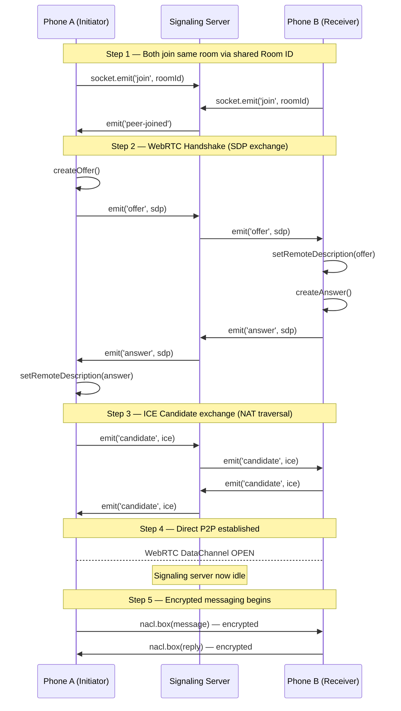

---

## 4. Encryption Design

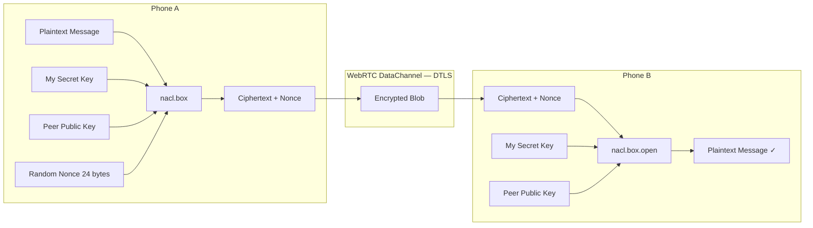

### How nacl.box works

```
nacl.box(message, nonce, theirPublicKey, mySecretKey)
    │
    ├─ Performs Curve25519 Diffie-Hellman key exchange
    ├─ Derives shared secret from your keys
    ├─ Encrypts with XSalsa20 stream cipher
    └─ Authenticates with Poly1305 MAC

Result: authenticated + encrypted ciphertext
- Only the peer with the matching keypair can open it
- Any tampering is detected (MAC verification fails)
- Decryption failure = possible MITM → throw error
```

### Key types

| Key | Who holds it | Stored where |
|-----|-------------|--------------|
| My Public Key | Shared with peer | AsyncStorage + QR |
| My Secret Key | Never leaves device | AsyncStorage (device-local; see Privacy Tradeoffs) |
| Peer Public Key | Received from peer via QR | AsyncStorage |
| Nonce | Random per message | Prepended to ciphertext |

---

## 5. MITM Prevention

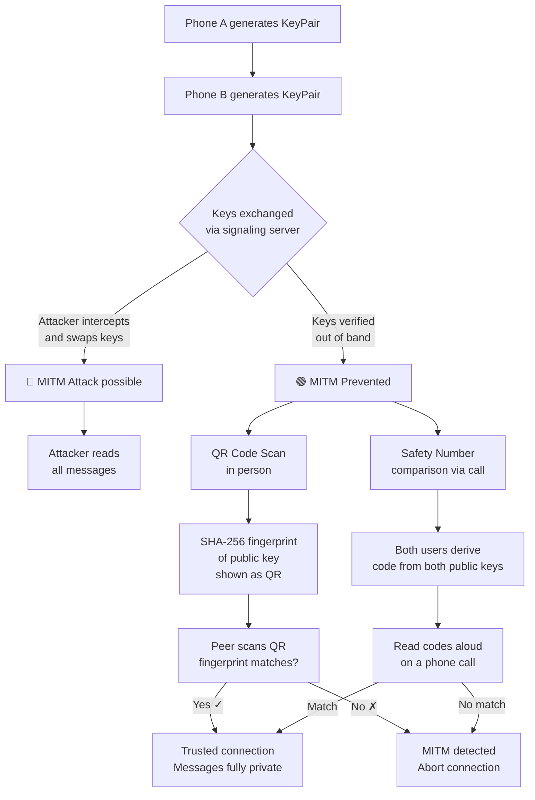

### Defense layers

```
Layer 1 — DTLS (WebRTC built-in)
  Protects against: passive network eavesdroppers
  Does NOT protect against: malicious signaling server

Layer 2 — nacl.box (tweetnacl)
  Protects against: signaling server interception
  Does NOT protect against: key substitution during handshake

Layer 3 — QR / Safety Number Verification  ← THE CRITICAL ONE
  Protects against: key substitution (MITM at signaling level)
  How: verify key fingerprint through a trusted out-of-band channel
  Result: attacker would need to compromise the out-of-band channel too
```

### Safety number generation

```javascript
// Generate a human-readable safety number from both public keys
const getSafetyNumber = (myPublicKey, peerPublicKey) => {
  const combined = new Uint8Array([...myPublicKey, ...peerPublicKey]);
  const hash = nacl.hash(combined); // SHA-512
  // Convert to readable groups of digits
  return Array.from(hash.slice(0, 15))
    .map(b => b.toString().padStart(3, '0'))
    .join(' ')
    .match(/.{1,15}/g)
    .join('\n');
};

// Both users must see the SAME number
// If an attacker swapped keys, the numbers will differ
```

---

## 6. Offline Message Handling

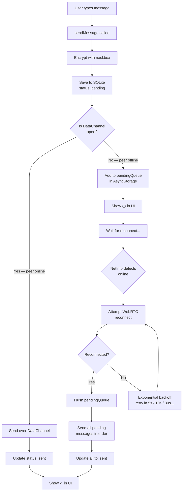

### Message status lifecycle

```
[typing] → [pending 🕐] → [sent ✓] → [delivered ✓✓]

pending  = encrypted, saved locally, DataChannel closed
sent     = delivered to peer's DataChannel
delivered = peer's app confirmed receipt (send ACK back)
```

### Pending queue

```javascript
// storage/pendingQueue.js
const QUEUE_KEY = 'pending_messages';

export const enqueue = async (message) => {
  const queue = await getQueue();
  queue.push(message);
  await AsyncStorage.setItem(QUEUE_KEY, JSON.stringify(queue));
};

export const flush = async (sendFn) => {
  const queue = await getQueue();
  const failed = [];

  for (const msg of queue) {
    const delivered = await sendFn(msg.text);
    if (!delivered) failed.push(msg); // still offline
  }

  await AsyncStorage.setItem(QUEUE_KEY, JSON.stringify(failed));
};

const getQueue = async () => {
  const raw = await AsyncStorage.getItem(QUEUE_KEY);
  return raw ? JSON.parse(raw) : [];
};
```

---

## 7. Key Verification Flow

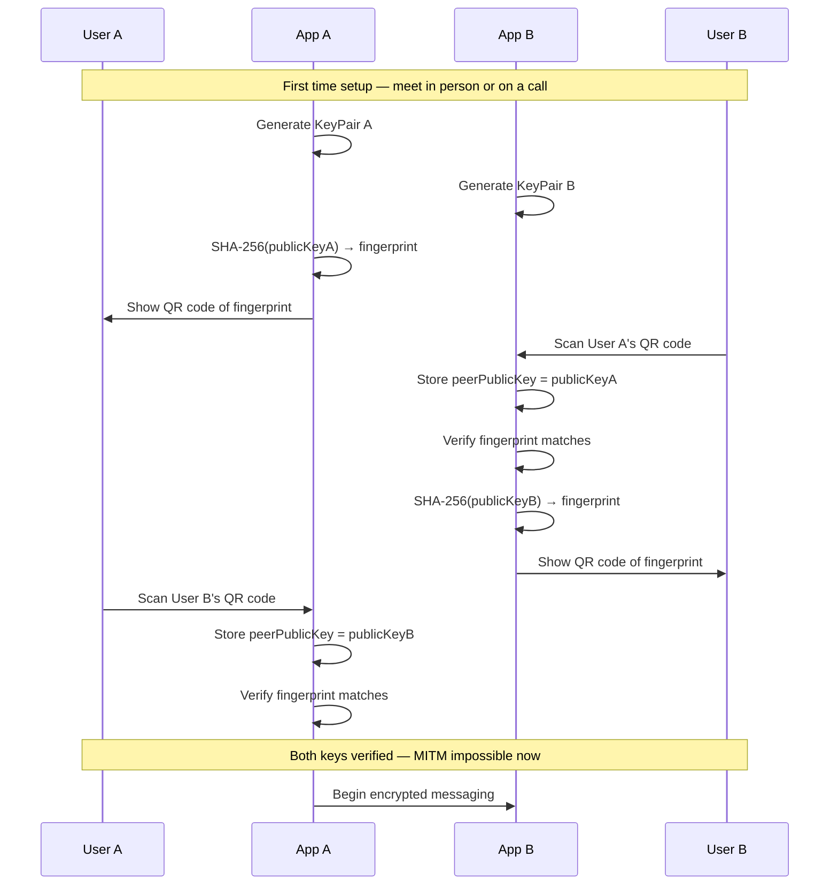

---

## 8. Sending Images

Images travel over the same encrypted DataChannel as text — boxed with the
same NaCl layer, then split into transport chunks because SCTP caps the size
of an individual DataChannel message.

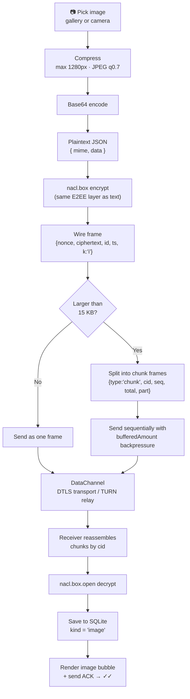

### Chunking on the wire

```
One encrypted wire frame (e.g. a 400 KB image after base64):

┌─────────────────────────────────────────────────────────┐
│ {"nonce":"...","ciphertext":"AAAA……ZZZZ","k":"i","id":…} │
└─────────────────────────────────────────────────────────┘
                     │  split every 15,000 chars
                     ▼
{"type":"chunk","cid":"m3k2","seq":0,"total":27,"part":"{\"nonce\"…"}
{"type":"chunk","cid":"m3k2","seq":1,"total":27,"part":"…4AfR2q…"}
                     …
{"type":"chunk","cid":"m3k2","seq":26,"total":27,"part":"…\"i\"}"}

Receiver:  buffer[cid][seq] = part
           when received == total → join → decrypt → done
```

Two safeguards in the send loop:
- pause whenever `channel.bufferedAmount` exceeds **4 MB** so the SCTP send
  buffer never overflows;
- yield to the JS event loop every 8 frames so the UI stays responsive.

Security is identical to text: image bytes exist in plaintext only on the two
devices. The chunking layer, the DataChannel, and any TURN relay in the path
all see ciphertext only.

---

## 9. Voice & Video Calls

Calls reuse the **existing** peer connection. The call is negotiated *over
the already-encrypted DataChannel*, and the audio/video tracks ride the same
ICE transport thanks to `bundlePolicy: 'max-bundle'` — no new ICE candidates,
and the signaling server plays no part mid-call.

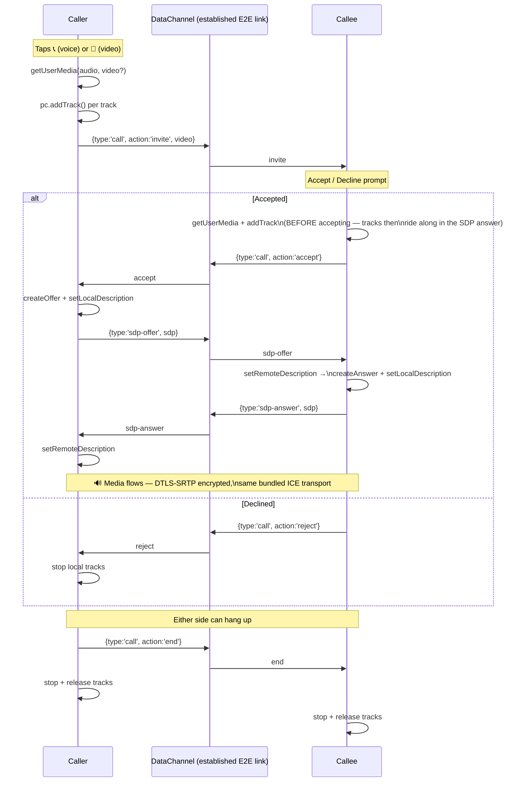

### How call media is secured

```
Layer 1 — DTLS-SRTP (mandatory in WebRTC, cannot be disabled)
  Every audio/video packet is encrypted and authenticated end-to-end.
  Keys come from the DTLS handshake between the two devices — a TURN
  relay in the path forwards packets it cannot decrypt.

Layer 2 — Authenticated call setup
  Invite / accept / SDP renegotiation frames travel INSIDE the
  DataChannel, which was established with the peer whose public key
  you verified (QR / safety number). An attacker cannot inject or
  hijack a call without first defeating the key verification layer.
```

### In-call controls

| Control | Mechanism |
|---------|-----------|
| Mute 🎤/🔇 | `track.enabled = false` on local audio tracks |
| Camera on/off | `track.enabled = false` on the local video track |
| Hang up 📵 | `{action:'end'}` over the DataChannel; both sides stop tracks |
| Local preview | `RTCView` with `mirror` on the local stream |

A voice-only call is the same flow with `getUserMedia({ audio: true })` and
`video: false` in the invite.

---

## 10. Wire Protocol

Everything on the DataChannel is a JSON frame. Two encryption regimes apply:

- **NaCl-boxed** — content readable only after `nacl.box.open` with the right keys
- **DTLS-only** — control frames carrying no message content; still encrypted
  in transit by the channel itself, and only exchangeable with the verified peer

| Frame | Shape | Encryption | Purpose |
|-------|-------|------------|---------|
| Text message | `{nonce, ciphertext, id, ts}` | NaCl box | Ciphertext decrypts to the text |
| Image message | `{nonce, ciphertext, id, ts, k:'i'}` | NaCl box | Ciphertext decrypts to `{mime, data}` |
| Delivery ACK | `{type:'ack', id}` | DTLS-only | Flips ✓ to ✓✓ for message `id` |
| Chunk | `{type:'chunk', cid, seq, total, part}` | carries NaCl ciphertext | Transport split of any frame > 15 KB |
| Call signal | `{type:'call', action, video}` | DTLS-only | `invite` / `accept` / `reject` / `end` |
| Renegotiation | `{type:'sdp-offer' \| 'sdp-answer', sdp}` | DTLS-only | Adds/removes media m-lines mid-session |

Receive-side dispatch: `chunk` reassembly, `call`, and `sdp-*` are consumed in
the transport layer (`peerConnection.js`); everything else (messages, ACKs)
is passed up to the app layer (`usePeer.js`) for decryption and storage.

---

## 11. Project Structure

```
p2p-chat/
│
├── android/                         # Android native config
│   └── app/src/main/AndroidManifest.xml
│
├── ios/                             # iOS native config
│
├── server/                          # Signaling server (deploy separately)
│   ├── index.js                     # Socket.io signaling + embedded node-turn TURN relay
│   └── package.json
│
└── src/
    │
    ├── crypto/
    │   ├── keyManager.js            # Generate & store keypair
    │   ├── encryptor.js             # Encrypt / decrypt messages
    │   └── safetyNumber.js          # MITM verification codes
    │
    ├── webrtc/
    │   ├── peerConnection.js        # RTCPeerConnection + DataChannel
    │   └── signalingService.js      # Socket.io signaling client
    │
    ├── storage/
    │   ├── messageStore.js          # SQLite CRUD for messages
    │   ├── pendingQueue.js          # Offline outbox
    │   └── db.js                    # SQLite init & migrations
    │
    ├── hooks/
    │   ├── usePeer.js               # WebRTC lifecycle + send text/images + call signals
    │   ├── useMessages.js           # Message list state + SQLite
    │   ├── useEncryption.js         # Keypair + peer key state
    │   ├── useNetworkStatus.js      # Online/offline detection
    │   └── usePushKit.js            # iOS VoIP wake events
    │
    ├── screens/
    │   ├── SetupScreen.js           # First launch + room ID entry
    │   ├── ChatScreen.js            # Chat UI + call buttons + image attach + incoming-call prompt
    │   ├── CallScreen.js            # Voice/video call UI (RTCView, mute, hang-up)
    │   └── VerifyScreen.js          # QR show + scan + manual key paste (emulators)
    │
    ├── components/
    │   ├── MessageBubble.js         # Single message with status
    │   ├── MessageList.js           # FlatList of messages
    │   ├── MessageInput.js          # Text input + send button
    │   └── ConnectionStatusBar.js   # Online / connecting / offline
    │
    └── App.js                       # Root + navigation
```

---

## 12. Component Breakdown

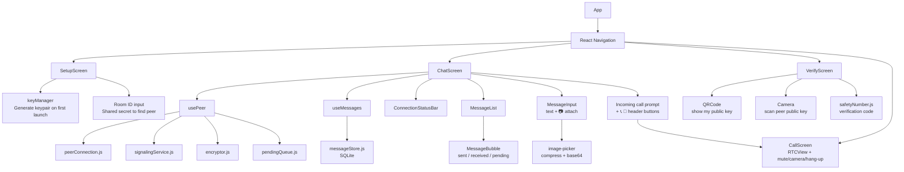

---

## 13. Data Models

### Message (SQLite)

```sql
CREATE TABLE messages (
  id          TEXT PRIMARY KEY,    -- unique message id
  text        TEXT NOT NULL,       -- plaintext, or a data-URI for images (local only)
  from_peer   INTEGER NOT NULL,    -- 0 = me, 1 = peer
  status      TEXT NOT NULL,       -- 'pending' | 'sent' | 'delivered' | 'received'
  timestamp   INTEGER NOT NULL,    -- Unix ms
  nonce       TEXT,                -- base64 nonce used (for dedup)
  kind        TEXT DEFAULT 'text'  -- 'text' | 'image'
);
```

### KeyPair (AsyncStorage)

```json
{
  "publicKey": "base64-encoded-32-bytes",
  "secretKey": "base64-encoded-32-bytes",
  "peerPublicKey": "base64-encoded-32-bytes",
  "peerVerified": true,
  "roomId": "shared-room-id"
}
```

### Pending Queue (AsyncStorage)

```json
[
  {
    "id": "uuid",
    "text": "plaintext message",
    "timestamp": 1720000000000,
    "retries": 2
  }
]
```

### Wire format (over DataChannel)

Text message (image messages add `"k": "i"` and their ciphertext decrypts to
`{mime, data}` — the complete frame catalogue is in [§10 Wire Protocol](#10-wire-protocol)):

```json
{
  "nonce": "base64-24-bytes",
  "ciphertext": "base64-encrypted-payload",
  "id": "message-uuid",
  "ts": 1720000000000
}
```

---

## 14. Signaling + TURN Server

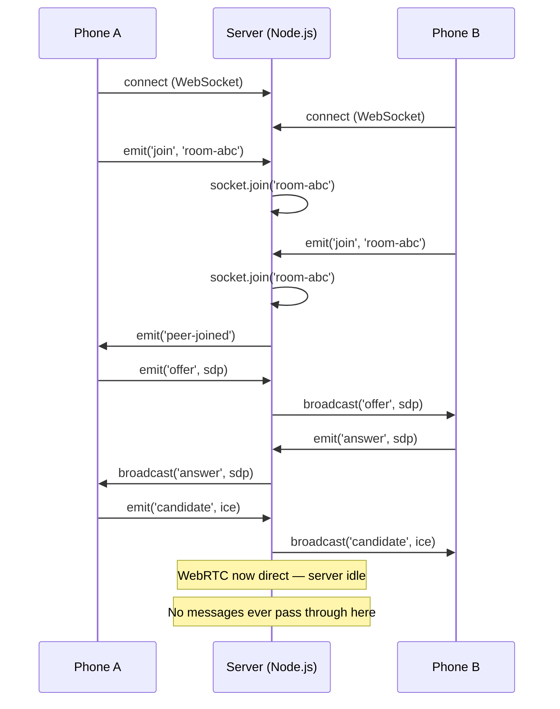

### One process, two jobs

The server (`server/index.js`) hosts **signaling** (socket.io, port **7788**)
and a **TURN relay** (`node-turn`, port **3478**) in one Node process. TURN is
what lets two peers connect when neither can accept inbound traffic — e.g.
two Android emulators, or phones behind carrier-grade NAT.

> Port 7788 instead of the classic 3000: dev servers (create-react-app etc.)
> squat on 3000 and hop to 3001, 3002… when busy. A silent port collision on
> Windows (two processes can LISTEN on the same port) cost hours of debugging.

```javascript
// server/index.js — essentials (full file adds iOS VoIP push support)
const { createServer } = require('http');
const os = require('os');
const { Server } = require('socket.io');
const Turn = require('node-turn');

const PORT = process.env.PORT || 7788;
const httpServer = createServer();
const io = new Server(httpServer, { cors: { origin: '*' } });

io.on('connection', (socket) => {
  socket.on('join', ({ roomId, platform, iosToken }) => {
    socket.join(roomId);
    socket.data.roomId = roomId;
    socket.to(roomId).emit('peer-joined');
  });

  socket.on('offer',     (d) => socket.to(socket.data.roomId).emit('offer', d));
  socket.on('answer',    (d) => socket.to(socket.data.roomId).emit('answer', d));
  socket.on('candidate', (d) => socket.to(socket.data.roomId).emit('candidate', d));

  socket.on('disconnect', () => {
    socket.to(socket.data.roomId).emit('peer-offline');
  });
});

// TURN relay — bind relay sockets to a real LAN adapter (not WSL/Hyper-V
// virtual ones) so relayed candidates are reachable by both peers.
const ifaceAddrs = Object.entries(os.networkInterfaces()).flatMap(
  ([name, addrs]) => (addrs || []).map((a) => ({ name, ...a }))
).filter((a) => a.family === 'IPv4' && !a.internal);
const lanIp = (
  ifaceAddrs.find((a) => !/vethernet|wsl|virtualbox|vmware|hyper-v/i.test(a.name)) ||
  ifaceAddrs[0]
)?.address;

const turnServer = new Turn({
  listeningPort: 3478,
  listeningIps: ['0.0.0.0'],
  relayIps: lanIp ? [lanIp] : undefined,
  authMech: 'long-term',
  credentials: { p2p: 'p2pchat' },
  debugLevel: 'ERROR',
});
turnServer.start();

// node-turn relays blindly toward whatever peer addresses ICE offers,
// including unroutable ones (e.g. emulator-internal 10.0.2.x). Those async
// dgram errors must not kill signaling — log and keep serving.
process.on('uncaughtException', (err) => console.error('[survived]', err.message));

httpServer.listen(PORT, () => console.log(`Signaling server on :${PORT}`));
```

---

## 15. Full Code Reference

### keyManager.js

```javascript
import nacl from 'tweetnacl';
import { encodeBase64, decodeBase64 } from 'tweetnacl-util';
import AsyncStorage from '@react-native-async-storage/async-storage';

const KEY = 'keypair';

export const initKeys = async () => {
  const stored = await AsyncStorage.getItem(KEY);
  if (stored) {
    const { publicKey, secretKey } = JSON.parse(stored);
    return {
      publicKey: decodeBase64(publicKey),
      secretKey: decodeBase64(secretKey),
    };
  }
  const keyPair = nacl.box.keyPair();
  await AsyncStorage.setItem(KEY, JSON.stringify({
    publicKey: encodeBase64(keyPair.publicKey),
    secretKey: encodeBase64(keyPair.secretKey),
  }));
  return keyPair;
};

export const storePeerPublicKey = async (peerPubKeyBase64) => {
  await AsyncStorage.setItem('peerPublicKey', peerPubKeyBase64);
};

export const getPeerPublicKey = async () => {
  const raw = await AsyncStorage.getItem('peerPublicKey');
  return raw ? decodeBase64(raw) : null;
};

export const getFingerprint = (publicKey) => {
  const hash = nacl.hash(publicKey);
  return encodeBase64(hash).slice(0, 32);
};
```

### encryptor.js

> ⚠️ tweetnacl-util's naming is inverted from what you'd expect:
> `decodeUTF8(string) → Uint8Array` and `encodeUTF8(Uint8Array) → string`.
> Getting these backwards throws `TypeError: unexpected type, use Uint8Array`
> the first time you send a message.

```javascript
import nacl from 'tweetnacl';
import { encodeUTF8, decodeUTF8, encodeBase64, decodeBase64 } from 'tweetnacl-util';

export const encrypt = (text, peerPublicKey, mySecretKey) => {
  const nonce = nacl.randomBytes(nacl.box.nonceLength); // 24 bytes
  // decodeUTF8 = string -> Uint8Array (yes, really)
  const message = decodeUTF8(text);
  const ciphertext = nacl.box(message, nonce, peerPublicKey, mySecretKey);
  return {
    nonce: encodeBase64(nonce),
    ciphertext: encodeBase64(ciphertext),
  };
};

export const decrypt = (payload, peerPublicKey, mySecretKey) => {
  const nonce = decodeBase64(payload.nonce);
  const ciphertext = decodeBase64(payload.ciphertext);
  const decrypted = nacl.box.open(ciphertext, nonce, peerPublicKey, mySecretKey);
  if (!decrypted) {
    throw new Error('Decryption failed — tampered or wrong keys');
  }
  // encodeUTF8 = Uint8Array -> string
  return encodeUTF8(decrypted);
};
```

### peerConnection.js

The transport layer. Beyond the original offer/answer plumbing it now owns
**chunk reassembly**, **call signal routing**, **media tracks**, and
**in-call SDP renegotiation** (full file: `src/webrtc/peerConnection.js`).

```javascript
import {
  RTCPeerConnection, RTCIceCandidate, RTCSessionDescription, mediaDevices,
} from 'react-native-webrtc';

const ICE_CONFIG = {
  iceServers: [
    { urls: 'stun:stun.l.google.com:19302' },
    { urls: 'stun:stun1.l.google.com:19302' },
    // Local TURN relay (runs inside server/index.js on port 3478).
    // 10.0.2.2 = host as seen from the emulator; LAN IP for real phones;
    // a public coturn server in production.
    { urls: 'turn:10.0.2.2:3478?transport=udp', username: 'p2p', credential: 'p2pchat' },
  ],
  // Everything (data + audio + video added later) rides ONE ICE transport,
  // so in-call renegotiation never needs a fresh round of candidates.
  bundlePolicy: 'max-bundle',
};

const CHUNK_SIZE = 15000;             // SCTP-safe frame size
const MAX_BUFFERED = 4 * 1024 * 1024; // backpressure threshold
```

**Receive-side dispatch** — transport concerns are consumed here; the app
layer only ever sees complete message frames:

```javascript
_route(data) {
  let p = null;
  try { p = JSON.parse(data); } catch {}
  if (p && p.type === 'chunk')      { const full = this._receiveChunk(p); if (full) this.onMessage?.(full); return; }
  if (p && p.type === 'call')       { this.onCallSignal?.(p); return; }
  if (p && p.type === 'sdp-offer')  { this._answerRenegotiation(p.sdp); return; }
  if (p && p.type === 'sdp-answer') { this.pc?.setRemoteDescription(new RTCSessionDescription(p.sdp)); return; }
  this.onMessage?.(data);
}
```

**Chunked send** — with SCTP buffer backpressure:

```javascript
async sendLarge(wire) {
  if (this.channel?.readyState !== 'open') return false;
  if (wire.length <= CHUNK_SIZE) { this.channel.send(wire); return true; }

  const cid = Date.now().toString(36) + Math.random().toString(36).slice(2, 7);
  const total = Math.ceil(wire.length / CHUNK_SIZE);
  for (let seq = 0; seq < total; seq++) {
    while ((this.channel?.bufferedAmount || 0) > MAX_BUFFERED) {
      await new Promise((r) => setTimeout(r, 50));   // let SCTP drain
    }
    if (this.channel?.readyState !== 'open') return false;
    this.channel.send(JSON.stringify({
      type: 'chunk', cid, seq, total,
      part: wire.slice(seq * CHUNK_SIZE, (seq + 1) * CHUNK_SIZE),
    }));
    if (seq % 8 === 7) await new Promise((r) => setTimeout(r, 0)); // keep UI alive
  }
  return true;
}
```

**Media + renegotiation** — calls attach tracks to the *existing* connection
and negotiate over the DataChannel:

```javascript
async startMedia(withVideo) {
  this.localStream = await mediaDevices.getUserMedia({
    audio: true,
    video: withVideo ? { facingMode: 'user', width: 640, height: 480 } : false,
  });
  this.localStream.getTracks().forEach((t) => this.pc.addTrack(t, this.localStream));
  return this.localStream;
}

// Caller side, after the callee accepts: push new m-lines to the peer.
// No signaling server involved — the data channel carries the SDP.
async sendRenegotiationOffer() {
  const offer = await this.pc.createOffer();
  await this.pc.setLocalDescription(offer);
  this.channel?.send(JSON.stringify({
    type: 'sdp-offer', sdp: { type: offer.type, sdp: offer.sdp },
  }));
}

// Callee: tracks were added BEFORE accepting, so they ride in this answer.
async _answerRenegotiation(sdp) {
  await this.pc.setRemoteDescription(new RTCSessionDescription(sdp));
  const answer = await this.pc.createAnswer();
  await this.pc.setLocalDescription(answer);
  this.channel?.send(JSON.stringify({
    type: 'sdp-answer', sdp: { type: answer.type, sdp: answer.sdp },
  }));
}
```

### usePeer.js

The app layer: encrypt/decrypt, persistence, delivery ACKs, reconnect
backoff, and forwarding call signals up to the UI. It now returns
`{ sendMessage, sendImage, isConnected }` and accepts an `onCallSignal`
callback (full file: `src/hooks/usePeer.js`).

**Sending an image** — same E2EE, different plaintext, chunked transport:

```javascript
const sendImage = useCallback(async ({ mime, data }) => {
  const msg = {
    id: makeId(),
    text: `data:${mime};base64,${data}`,  // stored locally as a data-URI
    kind: 'image',
    from_peer: 0,
    status: 'pending',
    timestamp: Date.now(),
  };
  await saveMessage(msg);

  const payload = encrypt(JSON.stringify({ mime, data }), peerPublicKey, myKeys.secretKey);
  const wire = JSON.stringify({ ...payload, id: msg.id, ts: msg.timestamp, k: 'i' });

  const sent = await PeerConnection.sendLarge(wire);   // chunks transparently
  if (sent) {
    await updateMessageStatus(msg.id, 'sent');
    return { ...msg, status: 'sent' };
  }
  return msg; // images are not queued for offline retry — stays 'pending'
}, [myKeys, peerPublicKey]);
```

**Receiving** — one decrypt path for both kinds:

```javascript
PeerConnection.onMessage = async (raw) => {
  const payload = JSON.parse(raw);

  if (payload.type === 'ack') {                       // delivery receipt
    await updateMessageStatus(payload.id, 'delivered');
    onNewMessage({ type: 'ack', id: payload.id });
    return;
  }

  const plain = decrypt(payload, peerPublicKey, myKeys.secretKey);

  const msg = payload.k === 'i'
    ? { ...base, kind: 'image', text: dataUriFrom(JSON.parse(plain)) }
    : { ...base, kind: 'text',  text: plain };

  await saveMessage(msg);
  onNewMessage(msg);
  PeerConnection.send(JSON.stringify({ type: 'ack', id: payload.id }));
};
```

**Call signals** flow through a ref so the connection effect never re-runs
when the UI handler changes:

```javascript
const callSignalRef = useRef(onCallSignal);
callSignalRef.current = onCallSignal;
// inside the effect:
PeerConnection.onCallSignal = (signal) => callSignalRef.current?.(signal);
```

`ChatScreen` owns the call state machine (it stays mounted underneath
`CallScreen` in the navigation stack): `invite` → Accept/Decline prompt;
`accept` → caller fires `sendRenegotiationOffer()`; `reject`/`end` →
stop media and pop back to the chat.

---

## 16. Deployment

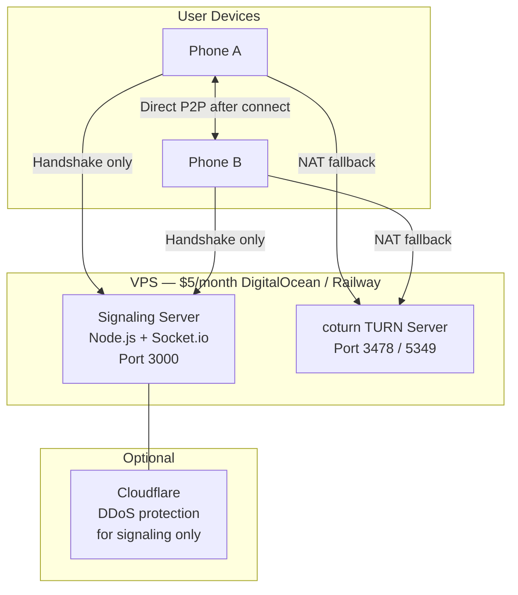

### coturn setup (TURN server)

```bash
# Install on Ubuntu VPS
sudo apt install coturn

# /etc/turnserver.conf
listening-port=3478
tls-listening-port=5349
realm=your-domain.com
user=youruser:yourpassword
lt-cred-mech
no-loopback-peers
no-multicast-peers
```

```javascript
// Use in ICE config (production)
const ICE_CONFIG = {
  iceServers: [
    { urls: 'stun:stun.l.google.com:19302' },
    {
      urls: 'turn:your-server.com:3478',
      username: 'youruser',
      credential: 'yourpassword'
    }
  ]
};
```

### Android permissions

```xml
<!-- android/app/src/main/AndroidManifest.xml -->
<uses-permission android:name="android.permission.INTERNET" />
<uses-permission android:name="android.permission.CAMERA" />                  <!-- QR scan + video calls + photos -->
<uses-permission android:name="android.permission.RECORD_AUDIO" />            <!-- voice/video calls -->
<uses-permission android:name="android.permission.MODIFY_AUDIO_SETTINGS" />   <!-- call audio routing -->
<uses-permission android:name="android.permission.ACCESS_NETWORK_STATE" />
<uses-permission android:name="android.permission.CHANGE_NETWORK_STATE" />
<uses-permission android:name="android.permission.READ_EXTERNAL_STORAGE" android:maxSdkVersion="32" /> <!-- gallery on old Android -->
```

> **Dev note:** locally, you don't need coturn at all — the project embeds a
> JS TURN server (`node-turn`) inside `server/index.js` on port 3478 with
> credentials `p2p` / `p2pchat`. Swap the client's ICE config to your coturn
> instance for production.

---

## 17. Build Order

```mermaid
gantt
    title P2P App Build Plan
    dateFormat  D
    section Foundation
    Key generation + AsyncStorage     :a1, 1, 1d
    Signaling server Node.js          :a2, 1, 1d
    section Core P2P
    WebRTC connect two phones         :a3, 2, 1d
    Encrypt/decrypt tweetnacl         :a4, 2, 1d
    section Storage
    SQLite message store              :a5, 3, 1d
    Offline queue + reconnect         :a6, 3, 1d
    section UX
    QR key verification               :a7, 4, 1d
    Chat UI — bubbles + status        :a8, 4, 1d
```

| Day | Task | Output |
|-----|------|--------|
| 1 | Key generation + signaling server | Keys persisted, server running |
| 2 | WebRTC + tweetnacl | Two phones exchange encrypted messages |
| 3 | SQLite + pending queue | Messages survive app restart, offline resilient |
| 4 | QR verification + Chat UI | Shippable prototype |

---

## 18. Privacy Tradeoffs

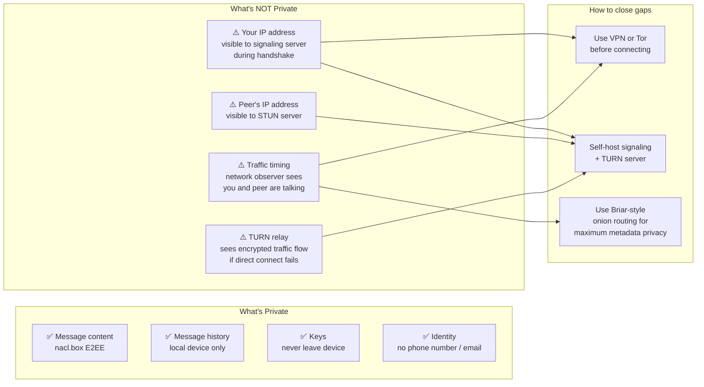

The same boundaries hold for the newer features: **images** are NaCl-boxed
exactly like text, and **call audio/video** is DTLS-SRTP encrypted end to
end. A TURN relay in the path forwards bytes it cannot decrypt — but it does
observe traffic volume and timing (a video call has an obvious traffic
signature even though its content is opaque).

### Comparison with existing apps

| App | Server | E2EE | Offline Delivery | Metadata |
|-----|--------|------|-----------------|---------|
| **Your app** | Signaling only | ✅ nacl.box | ❌ both must be online | IP leaked to signaling |
| **Signal** | Meta relay | ✅ Signal Protocol | ✅ server holds | Phone number required |
| **Tox** | None (DHT) | ✅ | ❌ both online | IP in DHT |
| **Briar** | None (Tor) | ✅ | ❌ both online | ✅ hidden via Tor |
| **Jami** | None (DHT) | ✅ | Partial | IP in DHT |

---

## 19. iOS Support

React Native and all packages support iOS, but iOS is significantly stricter than Android in ways that directly affect a P2P app. Here is every problem and its fix.

---

### iOS vs Android — Feature Matrix

| Feature | Android | iOS | Fix needed |
|---------|---------|-----|------------|
| WebRTC DataChannel | ✅ | ✅ | None |
| Foreground messaging | ✅ | ✅ | None |
| Background messaging | ✅ | ⚠️ Killed in ~30s | PushKit |
| Plain WS (ws://) | ✅ | ❌ ATS blocks | Use WSS |
| CocoaPods linking | Not needed | ✅ Required | pod install |
| Info.plist permissions | Not needed | ✅ Required | See below |
| Distribution | Sideload APK | TestFlight / App Store | See below |

---

### Problem 1 — Background Connectivity (Most Critical)

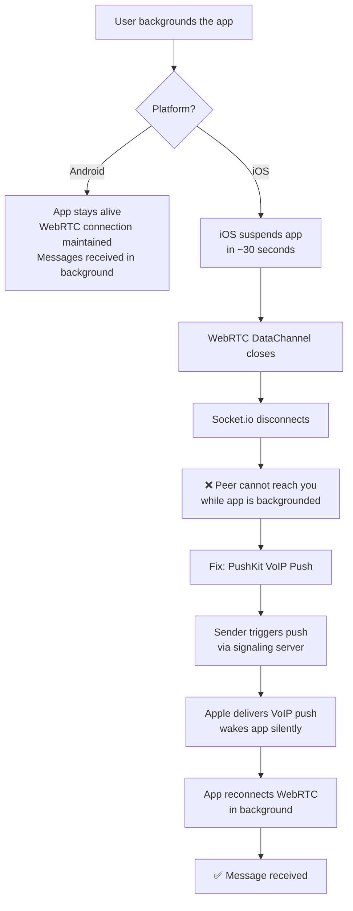

**How PushKit works for messaging:**

```
[Phone A wants to send]
      │
      ├─1─> Signaling server: "tell B to wake up"
      │         │
      │         └─2─> Apple APNs (VoIP push) → Phone B wakes silently
      │
      └─3─> WebRTC DataChannel opens
      └─4─> Encrypted message delivered directly peer-to-peer
```

> PushKit wakes the app. Apple only knows "wake this device."
> Message content still travels only over WebRTC — Apple never sees it.

---

### PushKit Setup — Step by Step

#### Step 1 — Apple Developer Portal

```
1. Go to developer.apple.com → Certificates, IDs & Profiles
2. Create a VoIP Services Certificate for your App ID
3. Download → export as .p12 file
4. Convert to PEM for your Node.js server:
   openssl pkcs12 -in voip.p12 -out voip.pem -nodes
```

#### Step 2 — Info.plist

```xml
<!-- ios/YourApp/Info.plist -->
<dict>

  <!-- Background modes — required for PushKit -->
  <key>UIBackgroundModes</key>
  <array>
    <string>voip</string>
    <string>fetch</string>
    <string>remote-notification</string>
  </array>

  <!-- Camera — for QR scanning -->
  <key>NSCameraUsageDescription</key>
  <string>Used to scan your peer's public key QR code</string>

  <!-- Local network — for LAN P2P discovery -->
  <key>NSLocalNetworkUsageDescription</key>
  <string>Used to establish a direct connection with your peer</string>

  <!-- Microphone — if you add voice calls later -->
  <key>NSMicrophoneUsageDescription</key>
  <string>Used for voice calls</string>

</dict>
```

#### Step 3 — AppDelegate.m (native iOS)

```objc
// ios/YourApp/AppDelegate.m
#import <PushKit/PushKit.h>

@interface AppDelegate () <PKPushRegistryDelegate>
@end

@implementation AppDelegate

- (BOOL)application:(UIApplication *)application
    didFinishLaunchingWithOptions:(NSDictionary *)launchOptions {

  // Register for VoIP pushes
  PKPushRegistry *registry = [[PKPushRegistry alloc]
    initWithQueue:dispatch_get_main_queue()];
  registry.delegate = self;
  registry.desiredPushTypes = [NSSet setWithObject:PKPushTypeVoIP];

  return YES;
}

// Called when device token is ready — send to your signaling server
- (void)pushRegistry:(PKPushRegistry *)registry
    didUpdatePushCredentials:(PKPushCredentials *)credentials
    forType:(PKPushType)type {

  NSData *token = credentials.token;
  // Send this token to your signaling server
  // so the other peer can trigger a wake push
  [[SignalingBridge shared] registerPushToken:token];
}

// Called when a VoIP push arrives — app wakes here
- (void)pushRegistry:(PKPushRegistry *)registry
    didReceiveIncomingPushWithPayload:(PKPushPayload *)payload
    forType:(PKPushType)type
    withCompletionHandler:(void (^)(void))completion {

  // Wake the React Native layer
  [RNCallKeep reportNewIncomingCall:...]; // or post a notification
  completion();
}
@end
```

#### Step 4 — React Native JS side

```javascript
// hooks/usePushKit.js (iOS only)
import { NativeEventEmitter, NativeModules, Platform } from 'react-native';

export const usePushKit = ({ onWakeUp }) => {
  useEffect(() => {
    if (Platform.OS !== 'ios') return;

    const emitter = new NativeEventEmitter(NativeModules.PushKitBridge);

    // Fired when iOS wakes us up from background
    const sub = emitter.addListener('onVoIPPushReceived', () => {
      onWakeUp(); // reconnect WebRTC here
    });

    return () => sub.remove();
  }, []);
};
```

#### Step 5 — Signaling server sends wake push

```javascript
// server/pushkit.js
const apn = require('apn'); // npm install apn

const provider = new apn.Provider({
  cert: './voip.pem',
  key: './voip.pem',
  production: false, // true for App Store builds
});

// Call this when Phone A wants to wake Phone B
const sendWakePush = async (deviceToken) => {
  const note = new apn.Notification();
  note.topic = 'com.yourapp.voip'; // your bundle ID + .voip
  note.payload = { wake: true };   // minimal payload — no message content
  note.priority = 10;              // high priority for VoIP

  await provider.send(note, deviceToken);
  // Apple wakes Phone B — WebRTC then delivers the actual message
};
```

---

### Problem 2 — HTTPS / WSS Required

iOS App Transport Security (ATS) blocks plain HTTP and WS by default.

```
ws://your-server.com:3000   ❌ Blocked by iOS ATS
wss://your-server.com       ✅ Required
```

**Fix — add SSL to your signaling server:**

```javascript
// server/index.js — WSS version
const https = require('https');
const fs = require('fs');
const { Server } = require('socket.io');

const httpsServer = https.createServer({
  key:  fs.readFileSync('/etc/letsencrypt/live/your-domain.com/privkey.pem'),
  cert: fs.readFileSync('/etc/letsencrypt/live/your-domain.com/fullchain.pem'),
});

const io = new Server(httpsServer, { cors: { origin: '*' } });
// ... rest of signaling logic unchanged

httpsServer.listen(443);
```

```bash
# Get a free SSL cert via Let's Encrypt (on your VPS)
sudo apt install certbot
sudo certbot certonly --standalone -d your-domain.com
# Auto-renews every 90 days
```

**Update your RN app to use WSS:**
```javascript
// webrtc/signalingService.js
const SIGNALING_URL = 'wss://your-domain.com'; // wss:// not ws://
```

---

### Problem 3 — CocoaPods Linking

`react-native-webrtc` requires native iOS linking via CocoaPods.

```bash
# After npm install, always run:
cd ios && pod install && cd ..

# If you hit issues:
cd ios
pod deintegrate
pod install
cd ..
```

**Podfile additions (auto-handled by react-native-webrtc but verify):**
```ruby
# ios/Podfile
platform :ios, '13.0'   # react-native-webrtc needs iOS 13+

target 'YourApp' do
  config = use_native_modules!
  use_react_native!(
    :path => config[:reactNativePath],
    :hermes_enabled => true
  )
  # react-native-webrtc pod is auto-linked
end
```

---

### Problem 4 — iOS Simulator Limitations

```
❌ WebRTC does NOT work in iOS Simulator
✅ Must test on a real iPhone (via Xcode or TestFlight)
```

```bash
# Run on physical device
npx react-native run-ios --device "Sourav's iPhone"

# Or open Xcode and select your device from the scheme menu
open ios/YourApp.xcworkspace
```

---

### Problem 5 — App Store / TestFlight Distribution

For a private two-person app, **TestFlight** is the easiest path — no full App Store review.

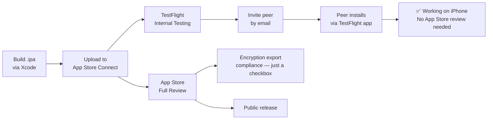

**Encryption export compliance (App Store only):**

When submitting, Apple asks about encryption. Answer:
- "Does your app use encryption?" → **Yes**
- "Does it qualify for ATS exemption?" → **Yes** (standard HTTPS + end-to-end encryption for messaging is exempt from export licensing under EAR)
- Check the box — it's a formality, not a blocker.

---

### iOS Project Structure Additions

```
ios/
├── YourApp/
│   ├── AppDelegate.m              # Add PushKit registration here
│   ├── AppDelegate.h
│   ├── Info.plist                 # Add permissions + background modes
│   └── PushKitBridge.m           # Native module — PushKit → RN bridge
├── YourApp.xcworkspace            # Always open this (not .xcodeproj)
└── Podfile                        # CocoaPods — pod install after changes
```

---

### iOS Build Order (on top of Android steps)

| Step | Task | Time |
|------|------|------|
| 1 | Switch signaling server to WSS + SSL cert | 1 hour |
| 2 | Run `pod install`, fix any linking issues | 1 hour |
| 3 | Add Info.plist permissions | 15 min |
| 4 | Test WebRTC on real iPhone (not simulator) | 1 hour |
| 5 | Add PushKit AppDelegate code | 2 hours |
| 6 | Write PushKitBridge native module (ObjC → RN) | 2 hours |
| 7 | Update signaling server to send VoIP pushes | 1 hour |
| 8 | TestFlight setup + invite peer | 1 hour |

**Total iOS extra effort: ~1 extra day** on top of the Android prototype.

---

### iOS Quick Checklist

```
□ Info.plist — voip background mode added
□ Info.plist — NSCameraUsageDescription added
□ Info.plist — NSLocalNetworkUsageDescription added
□ AppDelegate.m — PKPushRegistry registered
□ Signaling server — uses WSS (not WS)
□ SSL cert installed on server (Let's Encrypt)
□ pod install run after npm install
□ Tested on real iPhone (not simulator)
□ PushKit device token sent to signaling server
□ Signaling server can send VoIP push to wake peer
□ TestFlight configured for distribution
```

---

## Quick Reference

```
┌─────────────────────────────────────────────┐
│          WHAT EACH SERVER KNOWS             │
├─────────────────────────────────────────────┤
│ Signaling Server:                           │
│   - Both peers' IP addresses                │
│   - That two IPs connected at time T        │
│   - Room ID (not tied to identity)          │
│   - Nothing else                            │
├─────────────────────────────────────────────┤
│ STUN Server (Google):                       │
│   - Your public IP                          │
│   - Nothing else                            │
├─────────────────────────────────────────────┤
│ TURN Server (if used):                      │
│   - Both IPs                                │
│   - Encrypted traffic (cannot read)         │
│   - Traffic volume and timing               │
├─────────────────────────────────────────────┤
│ Nobody:                                     │
│   - Message content (E2EE)                  │
│   - Your keypair or identity                │
│   - Message history                         │
└─────────────────────────────────────────────┘
```

---

---

## 20. Cross-Platform Android ↔ iOS

WebRTC is a standard — it was built specifically so different platforms and browsers can talk to each other. Android ↔ iOS works fully out of the box. The only complication is background handling asymmetry between the two OSes.

---

### What is Fully Compatible

| Component | Android | iOS | Cross-platform? |
|-----------|---------|-----|----------------|
| WebRTC DataChannel | ✅ | ✅ | ✅ Standardized |
| tweetnacl encryption | ✅ | ✅ | ✅ Pure JS, keys are just bytes |
| Signaling (Socket.io) | ✅ | ✅ | ✅ Platform-agnostic |
| STUN / TURN / ICE | ✅ | ✅ | ✅ Network-level, no OS dependency |
| QR key verification | ✅ | ✅ | ✅ Same fingerprint both sides |
| nacl.box decryption | ✅ | ✅ | ✅ Curve25519 is universal |

---

### The Asymmetry — Background Handling

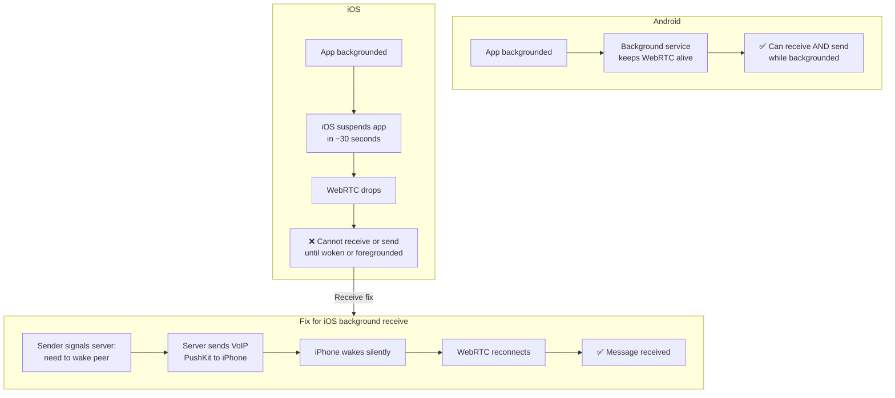

---

### All Scenarios

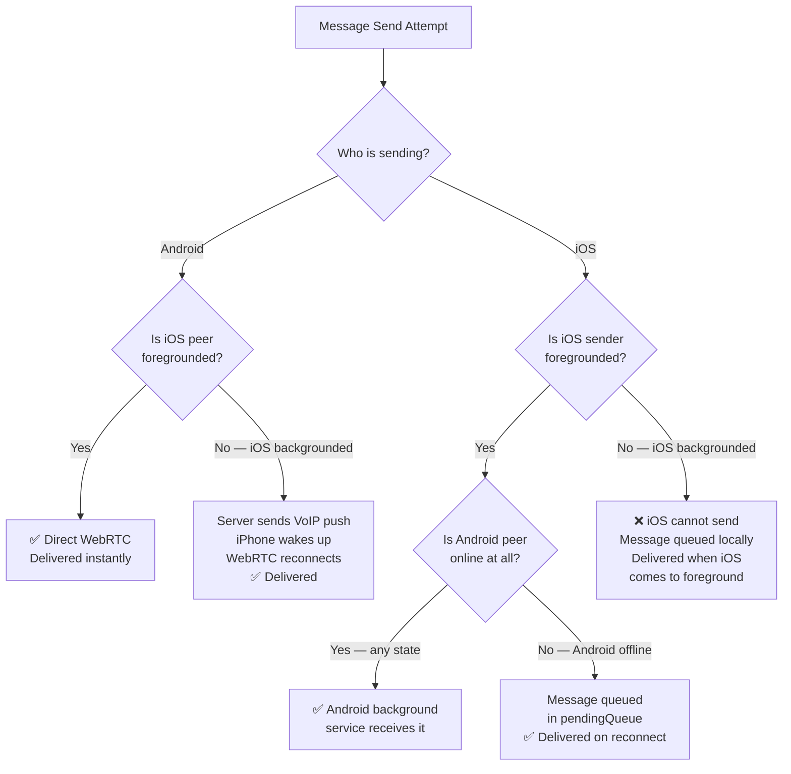

---

### Scenario Summary Table

| Sender | Receiver state | Result | Notes |
|--------|---------------|--------|-------|
| Android (fg/bg) | iOS foreground | ✅ Instant | |
| Android (fg/bg) | iOS background | ✅ With PushKit | Server sends VoIP push |
| iOS foreground | Android foreground | ✅ Instant | |
| iOS foreground | Android background | ✅ | Android bg service handles it |
| iOS foreground | Android offline | ✅ Queued | pendingQueue flushes on reconnect |
| iOS background | Any | ⚠️ Queued | iOS can't send while suspended — queued until user opens app |

> The last row is an iOS OS limitation. Every major messenger (WhatsApp, Signal, Telegram) has the same constraint — they handle it identically: queue the send, deliver when the app is next opened.

---

### Platform-Aware Signaling Server

The signaling server needs to know which platform each peer is on to decide whether to send a VoIP push.

```javascript
// server/index.js — platform-aware version
const apn = require('apn'); // npm install apn

const apnProvider = new apn.Provider({
  cert: './voip.pem',
  key:  './voip.pem',
  production: false, // true for App Store builds
});

// Track peer metadata per room
const peers = {}; // socketId → { roomId, platform, iosToken }

io.on('connection', (socket) => {

  // Peer registers platform + iOS VoIP token on join
  socket.on('join', ({ roomId, platform, iosToken }) => {
    socket.join(roomId);
    socket.data.roomId = roomId;
    peers[socket.id] = { roomId, platform, iosToken: iosToken || null };
    socket.to(roomId).emit('peer-joined');
  });

  // Called before sending a message — wakes iOS peer if needed
  socket.on('wake-peer', async () => {
    const roomId = socket.data.roomId;
    const roomSockets = [...(io.sockets.adapter.rooms.get(roomId) || [])];
    const otherSocketId = roomSockets.find(id => id !== socket.id);
    const peer = peers[otherSocketId];

    if (peer?.platform === 'ios' && peer?.iosToken) {
      // Peer is iOS and backgrounded — send VoIP push to wake
      await sendVoIPPush(peer.iosToken);
    }
    // Android peer — no action needed, background service handles it
  });

  socket.on('offer',     (data) => socket.to(socket.data.roomId).emit('offer', data));
  socket.on('answer',    (data) => socket.to(socket.data.roomId).emit('answer', data));
  socket.on('candidate', (data) => socket.to(socket.data.roomId).emit('candidate', data));

  socket.on('disconnect', () => {
    delete peers[socket.id];
    socket.to(socket.data.roomId).emit('peer-offline');
  });
});

const sendVoIPPush = async (deviceToken) => {
  const note = new apn.Notification();
  note.topic   = 'com.yourapp.voip'; // your bundle ID + .voip
  note.payload = { wake: true };     // no message content here — just wake signal
  note.priority = 10;                // highest priority for VoIP
  await apnProvider.send(note, deviceToken);
};
```

---

### React Native — Register Platform on Connect

```javascript
// webrtc/signalingService.js
import { Platform } from 'react-native';
import AsyncStorage from '@react-native-async-storage/async-storage';

class SignalingService {

  async connect(roomId, callbacks) {
    this.socket = io(SIGNALING_URL);

    // Get iOS VoIP token (null on Android)
    const iosToken = Platform.OS === 'ios'
      ? await AsyncStorage.getItem('iosVoIPToken')
      : null;

    this.socket.emit('join', {
      roomId,
      platform: Platform.OS,   // 'ios' or 'android'
      iosToken,                 // null on Android
    });

    this.socket.on('peer-joined', callbacks.onPeerJoined);
    this.socket.on('offer',       callbacks.onOffer);
    this.socket.on('answer',      callbacks.onAnswer);
    this.socket.on('candidate',   callbacks.onCandidate);
    this.socket.on('peer-offline', callbacks.onPeerOffline);
  }

  // Call this before sending a message — wakes iOS peer if needed
  wakePeer() {
    this.socket?.emit('wake-peer');
  }
}

export default new SignalingService();
```

---

### Updated sendMessage — Wake Peer First

```javascript
// hooks/usePeer.js — updated sendMessage
const sendMessage = useCallback(async (text) => {
  const msg = {
    id: Date.now().toString(),
    text,
    from_peer: 0,
    status: 'pending',
    timestamp: Date.now(),
  };

  await saveMessage(msg);

  // Step 1 — wake iOS peer if they are backgrounded
  SignalingService.wakePeer();

  // Step 2 — small delay to allow PushKit wake + WebRTC reconnect
  await new Promise(resolve => setTimeout(resolve, 1500));

  // Step 3 — encrypt and send
  const payload = encrypt(text, peerPublicKey, myKeys.secretKey);
  const wire = JSON.stringify({ ...payload, id: msg.id, ts: msg.timestamp });

  const sent = PeerConnection.send(wire);

  if (sent) {
    await updateMessageStatus(msg.id, 'sent');
    return { ...msg, status: 'sent' };
  } else {
    // Peer still not reachable — enqueue for later
    await enqueue(msg);
    return msg; // status remains pending
  }
}, [myKeys, peerPublicKey]);
```

---

### Store iOS VoIP Token (from PushKit)

```javascript
// hooks/usePushKit.js
import { Platform } from 'react-native';
import { NativeModules, NativeEventEmitter } from 'react-native';
import AsyncStorage from '@react-native-async-storage/async-storage';

export const usePushKit = ({ onWakeUp }) => {
  useEffect(() => {
    if (Platform.OS !== 'ios') return; // no-op on Android

    const emitter = new NativeEventEmitter(NativeModules.PushKitBridge);

    // Token received from Apple — save it so signaling server can use it
    const tokenSub = emitter.addListener('onVoIPTokenReceived', async (token) => {
      await AsyncStorage.setItem('iosVoIPToken', token);
      // Also update signaling server with new token
      SignalingService.updateToken(token);
    });

    // Wake signal received — reconnect WebRTC
    const wakeSub = emitter.addListener('onVoIPPushReceived', () => {
      onWakeUp(); // triggers PeerConnection.init() in usePeer
    });

    return () => {
      tokenSub.remove();
      wakeSub.remove();
    };
  }, []);
};
```

---

### Key Exchange Cross-Platform

Keys are just bytes — no platform-specific format. The QR code carries a base64 string that both Android and iOS generate and read identically.

```
Android generates:  nacl.box.keyPair() → Uint8Array → base64 string
iOS generates:      nacl.box.keyPair() → Uint8Array → base64 string

Android scans iOS QR  → decodeBase64 → Uint8Array → works as peerPublicKey ✅
iOS scans Android QR  → decodeBase64 → Uint8Array → works as peerPublicKey ✅

nacl.box(message, nonce, androidPubKey, iosSecretKey) → iOS encrypts to Android ✅
nacl.box(message, nonce, iosPubKey, androidSecretKey) → Android encrypts to iOS ✅
```

---

### Cross-Platform Quick Checklist

```
□ Signaling server stores platform + iosToken per peer
□ Signaling server sends VoIP push only when recipient is iOS
□ React Native app sends Platform.OS on join
□ iOS app saves VoIP token to AsyncStorage via PushKit
□ sendMessage calls wakePeer() before sending
□ 1.5s delay after wake before attempting send
□ pendingQueue handles the iOS-can't-send-backgrounded case
□ QR code uses base64 — identical format on both platforms
□ Tested Android → iOS message delivery ✅
□ Tested iOS → Android message delivery ✅
□ Tested Android bg → iOS bg delivery (PushKit wake) ✅
```

---

## 21. Local Development — Two-Emulator Testing

The topology that works on a single dev PC:

```
┌────────────────────────────── Your PC ─────────────────────────────┐
│                                                                    │
│   Metro (:8081)        Signaling (:7788)      TURN relay (:3478)   │
│       ▲                 socket.io              node-turn, same     │
│       │                     ▲                  server process      │
│       │                     │                   ▲            ▲     │
│  (adb reverse)         ┌────┴─────┐        ┌────┴────┐  ┌────┴───┐ │
│       │                │ 10.0.2.2 │        │ relay   │  │ relay  │ │
│       │                └────┬─────┘        │ sock A  │  │ sock B │ │
│       │                     │              └────▲────┘  └───▲────┘ │
│  ╔════╧══════╗        ╔═════╧═════╗             └──────┬────┘      │
│  ║ Emulator A ║       ║ Emulator B ║             media + data      │
│  ║ (own NAT)  ║       ║ (own NAT)  ║             hairpin via       │
│  ╚════════════╝       ╚════════════╝             host LAN IP       │
└────────────────────────────────────────────────────────────────────┘

Each emulator sits behind its OWN virtual NAT (both believe they are
10.0.2.15/16 internally). They can never reach each other directly —
every ICE candidate pair fails except relay ↔ relay through the local
TURN server. This is why TURN is mandatory for two-emulator testing.
```

### Hard-won facts

| Symptom | Cause | Fix |
|---------|-------|-----|
| `no PRNG` / `Buffer doesn't exist` / `TextEncoder doesn't exist` at startup | Hermes lacks these Node/browser globals | Polyfill imports first in `index.js` (see [§2](#2-tech-stack)) |
| Signaling times out or returns someone else's website | Another dev server squatting on ports 3000/3001 (Windows allows silent double-LISTEN) | Signaling lives on **7788** — keep it out of the 3000 range |
| Stuck on "Connecting to peer…" while candidates flow | STUN-only config — emulator NATs are mutually unreachable | Local TURN relay (`turn:10.0.2.2:3478?transport=udp`, `p2p`/`p2pchat`) |
| Server prints `Error: send ENETUNREACH / EADDRNOTAVAIL` blocks | Relay probing unroutable emulator-internal candidates | Harmless, expected noise — the process survives it |
| Can't QR-scan between two emulators | No camera passthrough between windows | VerifyScreen has a manual copy/paste key path |
| Silent calls / black video | Emulator devices disabled | Extended controls → Microphone → *host audio input*; camera renders a virtual scene |
| `react-native-get-random-values` v2 fails to install | Requires RN ≥ 0.81 | Pin v1: `npm i react-native-get-random-values@1` |

`10.0.2.2` always means "the host machine" from inside an Android emulator.
For a physical phone, replace it with the PC's LAN IP in
`signalingService.js` and `peerConnection.js`, and open inbound firewall
ports **7788/tcp** and **3478/udp**.

---

*Wormhole — built with: React Native · WebRTC · tweetnacl · SQLite · Node.js · node-turn/coturn*
*Philosophy: No accounts. No phone numbers. No cloud. Just two devices talking through a private tunnel.*
